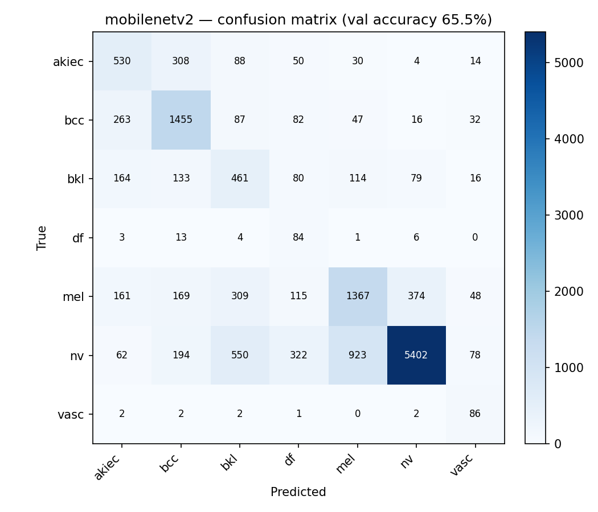
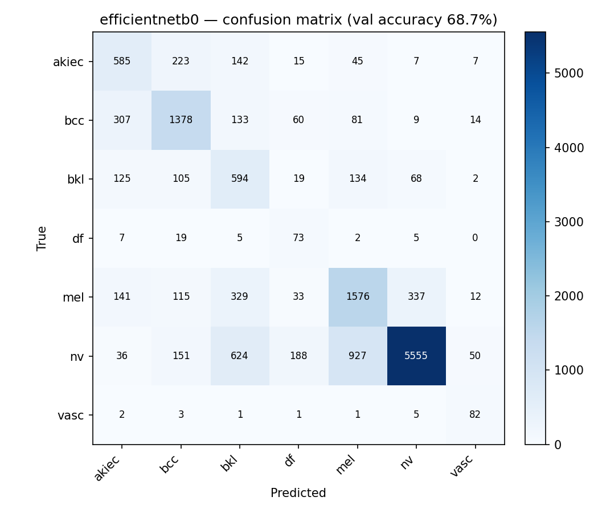

# SkinScan model evaluation

Held-out validation set: `manifest_val.csv` (14333 images).

Class order: `akiec` (Actinic keratoses / intraepithelial carcinoma), `bcc` (Basal cell carcinoma), `bkl` (Benign keratosis-like lesion), `df` (Dermatofibroma), `mel` (Melanoma), `nv` (Melanocytic nevus (common mole)), `vasc` (Vascular lesion).

| Model | Val accuracy | Malignant-vs-benign accuracy |
|---|---|---|
| mobilenetv2 | 63.636% | 79.990% |
| efficientnetb0 | 68.674% | 81.790% |

## mobilenetv2

```
              precision    recall  f1-score   support

       akiec      0.443     0.561     0.495      1024
         bcc      0.645     0.694     0.668      1982
         bkl      0.266     0.497     0.347      1047
          df      0.123     0.721     0.211       111
         mel      0.534     0.552     0.543      2543
          nv      0.926     0.675     0.781      7531
        vasc      0.458     0.863     0.599        95

    accuracy                          0.636     14333
   macro avg      0.485     0.652     0.520     14333
weighted avg      0.725     0.636     0.665     14333
```



## efficientnetb0

```
              precision    recall  f1-score   support

       akiec      0.486     0.571     0.525      1024
         bcc      0.691     0.695     0.693      1982
         bkl      0.325     0.567     0.413      1047
          df      0.188     0.658     0.292       111
         mel      0.570     0.620     0.594      2543
          nv      0.928     0.738     0.822      7531
        vasc      0.491     0.863     0.626        95

    accuracy                          0.687     14333
   macro avg      0.526     0.673     0.566     14333
weighted avg      0.747     0.687     0.707     14333
```


